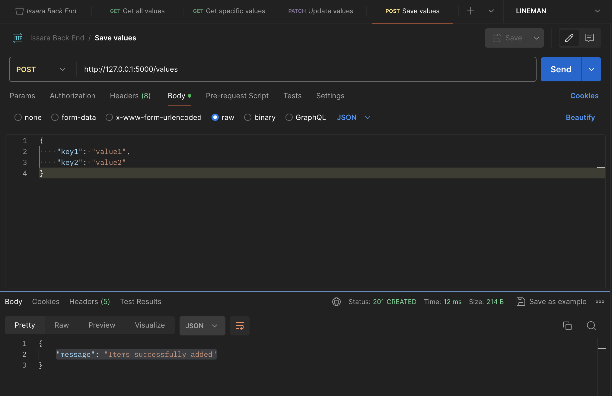
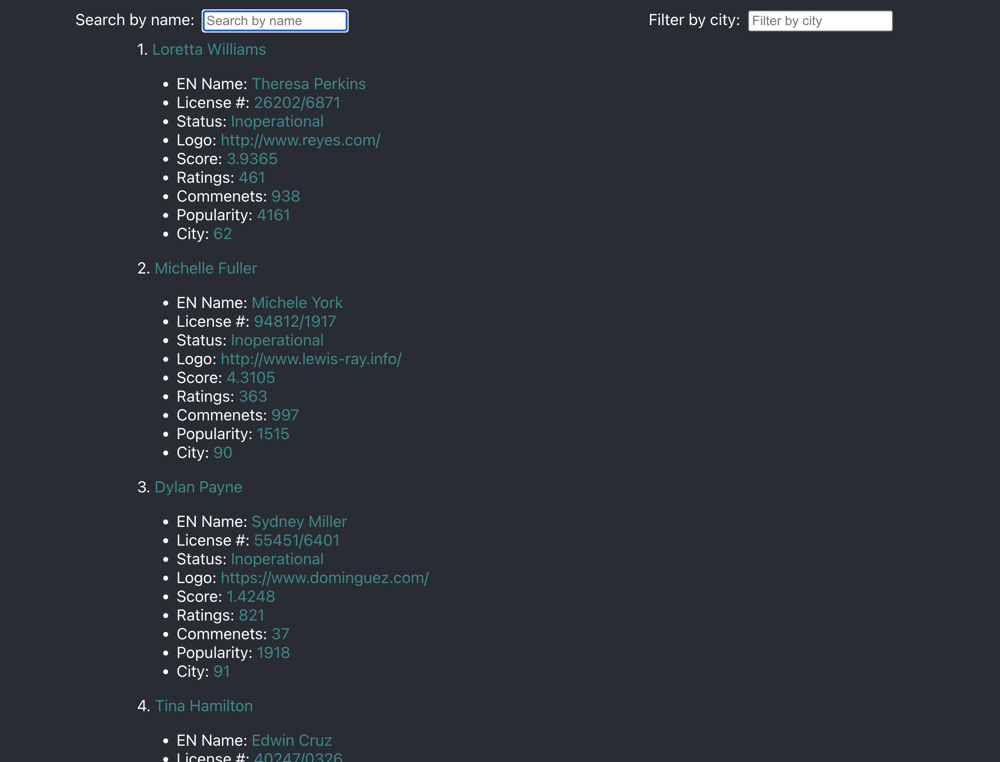

# Issara Institute Test Task

This is the coding challenge for the position of either front end or full stack developer at Issara Institute in Bangkok, Thailand. There are two separate sections: Back End & Full Stack.

## Table of Contents

- [Back End](#back-end)
    - [Installation](#installation-back-end)
    - [Usage](#usage-back-end)
    - [Notes](#notes-back-end)
- [Full Stack](#full-stack)
    - [Installation](#installation-full-stack)
    - [Usage](#usage-full-stack)
    - [Notes](#notes-full-stack)
- [Author](#author)
- [Tools Used](#tools-used)


## Back End

- [Installation](#installation-back-end)
- [Usage](#usage-back-end)
- [Notes](#notes-back-end)

### Installation {#installation-back-end}

1. Clone this github repository onto your machine
2. Install Docker onto your machine (get Docker [here](https://docs.docker.com/get-docker/))
3. Naviagate to the **Back_End** directory
    ```
    cd issara-test-tasks/Back_End
    ```
4. Build the Docker image
    ```
    docker build -t your-image-name .
    ```
5. Run the Docker container
    ```
    docker run -p 5000:5000 your-image-name
    ``` 
    - change port mapping if desired
6. Access in web browser, Postman, or other application

### Usage {#usage-back-end}

Build and run the docker container using the installation instructions.

**Endpoints:**
1. GET /values - Get all the values of the store and reset all TTL.
    - Response: `{key1: value1, key2: value2, key3: value3...}`

2. GET /values?keys=key1,key2 - Get one or more specific values from the store and also reset the TTL of those keys.
    - Response: `{key1: value1, key2: value2}`

3. POST /values - Save a value in the store.
    - Request: `{key1: value1, key2: value2..}`
    - Response: `{"message": "Items successfully added"}`

4. PATCH /values - Update a value in the store and also reset the TTL.
    - Request: `{key1: value1, key2: value2..}`
    - Response: `204 No Content`

Each key has a _Time to Live_ (TTL) of 300s (5 minutes). Creating, updating and retrieving will update the TTL of any key accessed.

Here is an example POST request using Postman:


### Notes {#notes-back-end}

[Original task](https://hackmd.io/@LagP9HgFSnK0trS0YWJFMg/rkUmu7mt6)

I followed the constraints as well as possible:
1. Use appropriate status codes with all the responses.
    - 200 for successful retrieval
    - 201 for creation
    - 204 for update
    - 400 for no keys (GET only) or invalid JSON
    - 404 when provided keys do not exist
    - 409 when attempting to create existing keys
    - I did not check for empty objects or nested values in the POST/PATCH endpoints. I did not feel it was necessary for this exercise, but it can be easily added.
2. Remove all values stored over more than 5 minutes. Set a TTL
    - TTL set 300 s. Can be changed in **key_val_store.py**
    - I do not actually remove keys when the TTL is complete. To keep things fast and simple, I simply remove expired keys when a request is made, before fulfilling the request. To do it in real time, I would create a separate worker thread that would check and remove the values each second. However, I felt that was overkill for this exercise.
3. Reset TTL on every GET Request.
    - The `get_keys()` function of the `KeyValStore` class will handles update and removal of keys based on TTL.
4. Has to be FAST
    - Flask is a lightweight application
    - This is fast at a smaller scale
    - At large scale, obviously there are a lot of loops to go through. This can be reduced by utilizing a separate thread for TTL removal (outlined above), or by redesigning the application (eg. using an actual DB). I didn't think it was necessary to have this application scale to extremely huge values.
5. Values can be of arbitrary length
    - The underlying structure is a dict, so no issues there.
6. Must be fault-tolerant, persistent
    - Errors handled as outlined above
    - `KeyValStore` class used for persistent data
7. Must deploy using Docker.
    - Completed. Instructions outlined above.


## Full Stack

- [Installation](#installation-full-stack)
- [Usage](#usage-full-stack)
- [Notes](#notes-full-stack)

### Installation {installation-full-stack}

1. Clone this github repository onto your machine
2. Install Docker onto your machine (get Docker [here](https://docs.docker.com/get-docker/))
3. Navigate to the **Full_Stack** directory
    ```
    cd issara-test-tasks/Full_Stack
    ```
3. Build and run the back end and front end Docker images using docker-compose
    ```
    docker-compose up
    ```
4. Open a web browser and go to [http://localhost:3000](http://localhost:3000)
    - Note: the backend can be accessed through port 8000

### Usage {#usage-full-stack}

Build and run the docker containers using the installation instructions.

There are 100 dealers stored in the database. They have randomly generated data for each field as outlined in the task. To access more data, scroll to the bottom of the screen and the next page of data will be appended (as long as it exists).
**Search** -> search is implemented on the _name_ and *name_en* fields of the Dealer model. Partial mathes included, leave blank for all.
**Filter** -> filter is implemented on the _city_ field of the Dealer model. Exact matches only, leave blank for all.

Here is a screenshot of the initial data fetch:


### Notes {#notes-full-stack}

[Original Task](https://hackmd.io/@snonF7mHR-mRvpnB8MljCg/ryjBYQC5T)

I followed the instructions as closely as possible.
1. Cursor-based pagination List API in Django
    - I used a Django backend with it's REST framework which includes cursor pagination.
2. Dummy data
    - all data is in the Django default SQLite database.
    - 100 dealer table entries created with values generated by Faker library.
        - See `./backend/cardealers/management/commands/add_dealer_data.py` for implentation details.
        - The data can be added with the command `python manage.py add_dealer_data`.
3. React.js infinite scroll
    - The API is called when the user is within 20px of the bottom of the list.
    - The next set of data is retrieved using the cursor and added to the existing data, increasing the size of the HTML element, and therefore the amount to scroll.
4. Search box by the dealer's name
    - Search is implemented in the API, and values are sent based on what is typed in the search box.
    - The results are determined using **icontains**, meaning any value containing the search parameter.
    - I wasn't sure if the search should be exclusively the name field, so I included the English name field as well.
        - (that's what I assume *name_en* means)
5. Filter by city on the frontend
    - Again, filtering is implemented in the API, and values are sent based on what is typed in the field.
    - The results are determined using **iexact**, meaning any value that is an exact match for the search parameter.
6. The mechanisms for filtering by city and searching by name should be implemented on the server-side API, with access provided to the frontend
    - See points 4 & 5 above.
7. Application can be executed using Docker
    - Both the backend and frontend are created with separate Docker images, and the containers can be set up and run individuallly.
    - I combined the two using docker-compose to have the app run all together at once.
    - See the installation instructions for usage.
8. A few things I would improve:
    - In the real world, there would be a security layer for accessing the API. This would most likely be a token authorization system. However, I did not feel the need to implement it for this excercise.
    - Normally, I would add a debounce method to the search/filter input fields as well to avoid hammering the API, or implement a search button. Again, I didn't see the necessity as this is a very small application.
    - The front end I created is quite lean. In a full-fledged application, there would be many more components, routing and display formatting. There were no specifics on how things should look, so I kept it minimal.
    - I would probably implement the city as a dropdown, translating numbers into names and other quality of life touches.
    - I would have the search/filter be floating on top or stay on the side so that you don't have to scroll back to the top to fine tune the results.
    - Obviously I would better format the results, displaying more important information more prominently, and excluding items like the _id_ field altogether.
    - I would implement a proper database for a production environment, with MySQL or similar, and create a more robust databse model for the various application entities.

## Author

Application created by [Jason Bishop](https://github.com/AttackMech/)

## Tools Used

- [Flask](https://flask.palletsprojects.com/) - Micro web framework for Python.
- [Docker](https://www.docker.com/) - Platform for developing, shipping, and running applications in containers.
- [Django](https://www.djangoproject.com/) - Web framework for backend development.
- [React](https://reactjs.org/) - JavaScript library for building user interfaces.